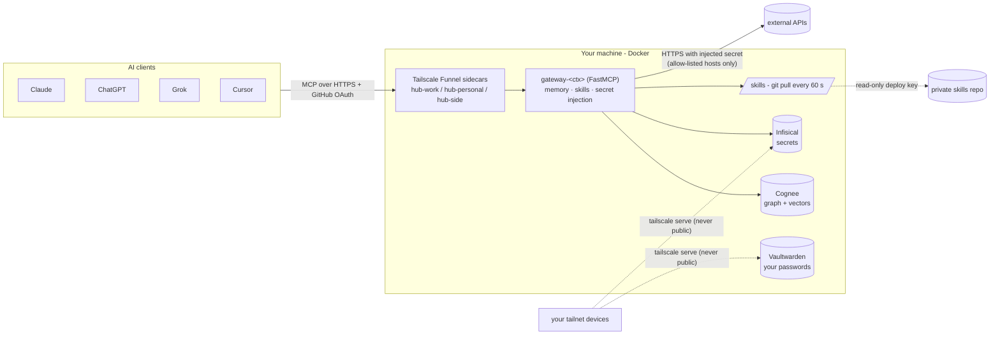

# Mnemos

**One brain for all your AIs.**

Mnemos is a self-hosted MCP hub that gives Claude, ChatGPT, Grok and Cursor the **same long-term memory, the same
skills and access to your API credentials without ever showing them the keys**, isolated by context (for example
work / personal / side projects). It runs on your own machine with Docker and is reachable from anywhere through
Tailscale Funnel, behind GitHub OAuth that only lets *you* in.

- **Memory**: a knowledge graph + vector store ([Cognee](https://github.com/topoteretes/cognee)) per context, plus a
  `shared` dataset for things every context should know (your profile, preferences).
- **Skills**: [Agent Skills](https://agentskills.io) (`SKILL.md` folders) synced from a private Git repo every 60 s.
- **Injected credentials**: secrets live in [Infisical](https://infisical.com); the model only sees names and asks
  the gateway to make the HTTPS call. The secret is injected server-side, only towards allow-listed hosts, and the
  response comes back redacted.
- **Isolation by context**: one gateway, one OAuth app, one Cognee user and one Infisical identity per context. Even
  a buggy gateway gets `403` from Cognee/Infisical for another context's data.

> Status: personal project, used daily by its author. The reference host is a Mac with Docker Desktop; Linux works
> for the Docker stack (see [macOS-only bits](#macos-only-bits-optional)). Code comments, some scripts' output and
> the detailed setup/ops guides are in Spanish; this README is the English entry point.

## Architecture



Nothing listens on `0.0.0.0`: local services bind to `127.0.0.1`, and the only public surface is one Funnel sidecar
per context, each in front of its gateway, each requiring OAuth with an allow-list of GitHub logins.

## Features

| MCP tool | What it does | Guardrails |
|---|---|---|
| `hub_whoami` | Context, datasets and projects visible to this connector | – |
| `memory_search` | Searches the context's memory (+ `shared` with `include_shared`) | Context datasets only; no LLM on reads |
| `memory_save` | Saves a fact to the context (or `shared`) | Contexts with projects require `project` |
| `memory_list` | Lists notes with id, dataset, date, source app and text | Context datasets (+ read-only `shared`) |
| `memory_update` / `memory_delete` | Fix (in place, same id) or remove one of the context's own notes | Never `shared`; marked destructive so clients ask first |
| `memory_history` / `memory_undo` | Previous versions of a note; undo the last fix or restore a removed note | Own notes only; history kept in the gateway's `ledger.sqlite` |
| `skills_list` / `skills_get` | Skills visible to the context (own folder + `shared` + `hub-share`) | No traversal, no symlinks |
| `secrets_list` | Secret **names** and allowed hosts | Never values |
| `secret_http_request` | Makes the HTTPS request with the secret injected | Exact host from the policy, port 443, no private IPs, no redirects, response redacted |

There are no tools to run commands or delete secrets. Every gateway writes a JSONL audit log (tool, context, result;
never content or secrets). Also included:

- **Live dashboard** (`127.0.0.1:8787`, optional tailnet-only): health of every piece, secrets per context (counts),
  datasets, backups, an *Explore* tab with the memory graph (Cytoscape.js, vendored), memories and skills per context.
- **Nightly jobs**: incremental `cognify` of pending memories, a memory-hygiene report (duplicates, superseded notes,
  secret-shaped text), restic backups with optional offsite copy (rclone), and a Funnel/DNS watchdog.
- **Dev stack** (`compose.dev.yaml`): Cognee + a fake OpenAI-compatible LLM + three gateways without auth (refuses to
  start unless the public URL is localhost), plus an end-to-end smoke test of context isolation.

## Stack

| Piece | Version / tech |
|---|---|
| Gateway | Python 3.12, [FastMCP](https://github.com/jlowin/fastmcp) 4.0, httpx, Infisical SDK, uvicorn |
| Memory | Cognee 1.6.1 (graph: Ladybug/Kuzu, vectors: LanceDB, metadata: SQLite); embeddings `fastembed` multilingual MiniLM (local) |
| Extraction LLM | OpenAI (`gpt-4o-mini`) **or** Ollama (`llama3.1:8b` with `instructor`) - free and local |
| Secrets | Infisical v0.165 (Postgres 14 + Redis 7.4), one project + read-only machine identity per context |
| Passwords | Vaultwarden 1.37 (for you, not for the models; tailnet-only) |
| Exposure | Tailscale 1.102 sidecars (userspace) with Funnel; `tailscale serve` for tailnet-only UIs |
| Skills | `skills-sync` (Alpine + git) pulling your private skills repo |
| Ops | restic, rclone, launchd agents (macOS, optional), stdlib-only dashboard |

## Requirements

- **Docker** with Compose v2 (Docker Desktop on macOS; give it 8 GB+ of RAM).
- **Tailscale** account with **MagicDNS, HTTPS certificates and Funnel** enabled, and an auth key tagged `tag:hub-public`.
- **Three GitHub OAuth Apps** (one per context; callback `https://hub-<ctx>.<tailnet>.ts.net/auth/callback`).
- An extraction LLM: an **OpenAI API key** or **Ollama** running on the host (`ollama pull llama3.1:8b`).
- Python 3.11+ on the host for the bootstrap scripts, tests and dashboard.
- A **private** GitHub repo for your skills (start from [`examples/skills/`](examples/skills/)).

## Quickstart

```bash
git clone https://github.com/<you>/mnemos && cd mnemos
./scripts/bootstrap.sh            # generates .env / cognee.env (chmod 600), config/*.yaml and the skills deploy key
python3 -m venv .venv && .venv/bin/pip install -e "gateway[dev]"

# edit .env: GITHUB_USER, TS_TAILNET, NOTEBOOK_TS_NAME, TS_AUTHKEY_PUBLIC, GH_OAUTH_*  (__COMPLETAR__ = fill me)
# edit cognee.env: pick OpenAI or Ollama
# edit config/contexts.yaml: your name and what belongs in each context
# add secrets/skills_deploy_key.pub as a read-only deploy key on your skills repo

docker compose up -d vaultwarden infisical-db infisical-redis infisical cognee skills-sync
.venv/bin/python scripts/bootstrap_infisical.py --bootstrap   # admin account, projects, read-only identities
.venv/bin/python scripts/bootstrap_cognee.py                  # users, datasets, per-context API keys
docker compose up -d                                          # Funnel sidecars + gateways
.venv/bin/python scripts/smoke_test.py --quick                # 401 + OAuth metadata on every hostname
```

The full step-by-step guide (Tailscale ACLs, OAuth apps, Infisical, Vaultwarden, backups) is in
[`docs/SETUP.es.md`](docs/SETUP.es.md); day-to-day operations in [`docs/OPERATIONS.es.md`](docs/OPERATIONS.es.md).

**Try it locally without any account** (fake LLM, no Tailscale, no OAuth):

```bash
docker compose -f compose.dev.yaml up -d --build
.venv/bin/python scripts/bootstrap_cognee.py --url http://127.0.0.1:18000 --dev \
    --datasets-out dev/state/cognee-datasets.json --dev-keys-dir dev/state
docker compose -f compose.dev.yaml up -d --force-recreate gateway-dev-work gateway-dev-personal gateway-dev-side
.venv/bin/python scripts/smoke_test.py --dev      # isolation between contexts, skills, secrets
docker compose -f compose.dev.yaml down -v
```

**Unit tests:** `.venv/bin/pytest -q gateway/tests`

## Connecting your assistants

One connector per context: `https://hub-<ctx>.<tailnet>.ts.net/mcp`. The login is always **your** GitHub account;
any other account is rejected.

- **Claude** (web, then Desktop/mobile): *Customize → Connectors → Add custom connector*, the URL, OAuth (dynamic
  client registration).
- **ChatGPT** (web): enable *Developer mode*, then create one app per context with the URL, streamable HTTP, OAuth.
- **Grok**: grok.com/connectors → *New Connector* → *Custom* → URL and authentication.
- **Cursor**: `~/.cursor/mcp.json` → `{"mcpServers": {"hub-work": {"url": "https://hub-work.<tailnet>.ts.net/mcp"}}}`
  (no secrets in the file; Cursor does the OAuth).

Each gateway sends per-context *server instructions* on `initialize` (built from `config/contexts.yaml`), so clients
that honor them know how to use the hub. For the others, paste the block in
[`docs/client-instructions.md`](docs/client-instructions.md). Check with `hub_whoami`, save a fact from one client and
find it from another.

## Configuration

| File | What | In git? |
|---|---|---|
| `.env` | Accounts, generated keys, OAuth apps, Infisical identities, restic | no (`.env.example`) |
| `cognee.env` | Cognee: LLM and embeddings | no (`cognee.env.example`) |
| `config/contexts.yaml` | Owner name, contexts, descriptions, projects -> datasets | no (`contexts.example.yaml`) |
| `config/secret-policy.yaml` | Which secret may go to which exact host, and how it is injected | no (`secret-policy.example.yaml`) |
| `config/cognee-datasets.json` | Dataset/user UUIDs, written by `bootstrap_cognee.py` | no |

### Adding or renaming a context

Renaming descriptions or projects only needs `config/contexts.yaml`, `scripts/bootstrap_cognee.py` and
`scripts/bootstrap_infisical.py` (all read it). To **add, remove or rename** contexts:

1. Edit `config/contexts.yaml`, then `python scripts/render_compose.py`: it writes `compose.generated.yaml`
   (gitignored) with one `ts-<ctx>` sidecar, `gateway-<ctx>` service and `ts_<ctx>` / `gw_<ctx>` volumes per
   context, using the `work` blocks of `compose.yaml` as the template. Set `COMPOSE_FILE=compose.generated.yaml`
   in `.env` so every `docker compose` call (and the scripts) use it. `scripts/update.sh` re-renders on update.
2. `.env`: `GH_OAUTH_<CTX>_ID/_SECRET`, `HUB_JWT_SIGNING_KEY_<CTX>`, `HUB_STORAGE_KEY_<CTX>`, `COGNEE_PW_<CTX>`,
   `COGNEE_KEY_<CTX>`, `INF_MI_<CTX>_ID/_SECRET` (`<CTX>` = upper case, `-` → `_`; mark generated ones
   `__GENERAR__`; `init_env.py` fills them).
3. A GitHub OAuth App and a folder `skills/<ctx>/` in your skills repo.
4. Optional: `compose.dev.yaml` and `scripts/smoke_test.py --dev` keep the three default contexts.

All sidecars share `config/tailscale/funnel/serve.json`. Volumes are named `<project>_<volume>`: keep
`COMPOSE_PROJECT_NAME` stable or Docker creates new, empty volumes.

The gateway, memory scoping, skills visibility, secret policy, dashboard (backend and UI), smoke test and watchdog
all read the context list from `config/contexts.yaml`.

## Updating

```bash
scripts/update.sh --dry-run      # what would change
scripts/update.sh                # latest v* tag (or: scripts/update.sh v0.2.0)
```

It fetches, checks out the ref, re-renders the compose file, rebuilds, `up -d`, runs `scripts/smoke_test.py
--quick` and, if anything fails, goes back to the previous ref automatically. It never runs `down` or touches
volumes or your gitignored config.

## Security

Short version (threat model in [`SECURITY.md`](SECURITY.md); what is and is not isolated in [`docs/memory-trust.md`](docs/memory-trust.md)):

- The only public endpoints are the `hub-<ctx>` Funnel hostnames, all behind GitHub OAuth with a login allow-list
  (`HUB_ALLOWED_GITHUB_LOGINS`, default `GITHUB_USER`).
- Models never see secret values: `secret_http_request` injects them server-side, only to exact allow-listed hosts on
  443, blocks private/CGNAT IPs and redirects, and redacts the secret from responses.
- Per-context credentials everywhere (Cognee user + API key, Infisical *Viewer* identity, OAuth app), so isolation does
  not depend on gateway code being bug-free.
- Memory and skills are treated as **data, not instructions** (stated in the server instructions).
- `.env`, `cognee.env`, `secrets/`, `data/`, `backups/` and your `config/*.yaml` are gitignored; CI runs gitleaks on
  the full history.

## macOS-only bits (optional)

The Docker stack is portable. These helpers are macOS-specific and **optional**:

- LaunchAgents installed by `scripts/install_backup_agent.sh`, `install_cognify_agent.sh`, `install_watchdog_agent.sh`
  and `scripts/dashboard.sh install-agent` (labels `${AIHUB_LABEL_PREFIX:-io.mnemos}.<job>`; logs in `~/Library/Logs`).
- Desktop notifications from the watchdog (`osascript`), `plutil`, `pmset`, and `host.docker.internal` for Ollama.

### Watchdog alerts off the machine (optional)

Desktop notifications only help if you are at the machine. To get alerts elsewhere, set one or both in `.env`
(both are off when empty):

- `MNEMOS_ALERT_WEBHOOK_URL`: POSTs JSON `{text, content, title, message, status}`, so a Slack or Discord incoming
  webhook works as is.
- `MNEMOS_ALERT_NTFY_TOPIC`: publishes to [ntfy](https://ntfy.sh) (`MNEMOS_ALERT_NTFY_SERVER` for self-hosted). Use a
  long random topic: anyone who knows it can read it.

You get one alert when a component goes down (`hub-<ctx>`, `cognee`, `dashboard`) and one when it recovers. A component
that flaps inside `MNEMOS_ALERT_COOLDOWN_S` (default 1800 s) doesn't alert again. Messages carry only the component name:
no hostnames, tailnet, IPs or error details. Runs with `--dry-run` or `--no-notify` never alert, and neither do runs where
the machine has no network. Test with `./scripts/hub_watchdog.py --test-alert`.

### Scheduling on Linux

Use cron or systemd timers that call the same scripts:

```cron
17 3 * * *   cd /opt/mnemos && ./scripts/backup.sh            >> ~/.local/state/mnemos-backup.log 2>&1
47 3 * * *   cd /opt/mnemos && ./scripts/cognify_nightly.sh   >> ~/.local/state/mnemos-cognify.log 2>&1
*/15 * * * * cd /opt/mnemos && .venv/bin/python scripts/hub_watchdog.py >> ~/.local/state/mnemos-watchdog.log 2>&1
```

On Linux, add `extra_hosts: ["host.docker.internal:host-gateway"]` to the `cognee` service if you use Ollama on the
host. The dashboard runs with `scripts/dashboard.sh start` (or a systemd user service running `dashboard/server.py`).

## Repository layout

| Path | What |
|---|---|
| `gateway/` | MCP server (FastMCP): OAuth + allow-list, per-context tools, secret broker, tests |
| `dashboard/` | Read-only live dashboard (`127.0.0.1` only) |
| `scripts/` | Bootstrap, update (`update.sh`), compose render, smoke test, backups/restore, nightly cognify, hygiene, watchdog, admin tools (+ `launchd/` templates) |
| `skills-sync/` | Container that keeps `/skills` in sync with your skills repo |
| `config/` | Example contexts and secret policy, shared Tailscale `serve.json`, ACL snippet |
| `dev/` | Fake OpenAI-compatible LLM, skill fixtures, Infisical e2e |
| `examples/skills/` | Starter skills repo (`review-pr`, `debug-error`, `status-report`, `technical-docs`) + validator |
| `docs/` | Setup and operations guides (Spanish), client instructions, memory editing, trust boundaries and gbrain skills (English) |
| `AGENTS.md`, `llms.txt` | Install checklist and doc index for AI agents |

## Contributing & license

See [`CONTRIBUTING.md`](CONTRIBUTING.md). Licensed under the [MIT License](LICENSE). Third-party: Cytoscape.js
(MIT, vendored in `dashboard/static/vendor/`); the stack pulls Cognee (Apache-2.0), Infisical (MIT core),
Vaultwarden (AGPL-3.0, used unmodified as a container image) and Tailscale images.

---

## Resumen en español

**Mnemos — un solo cerebro para todas tus IAs.** Hub MCP self-hosted que le da a Claude, ChatGPT, Grok y Cursor la
misma memoria de largo plazo (Cognee), las mismas skills (repo Git privado sincronizado cada 60 s) y acceso a tus APIs
con credenciales **inyectadas** desde Infisical (el modelo nunca ve las claves), todo aislado por contexto (p. ej.
trabajo / personal / side projects). Corre en tu máquina con Docker y se expone con Tailscale Funnel detrás de OAuth
de GitHub que solo te deja entrar a vos.

Para arrancar: `./scripts/bootstrap.sh`, completá `.env`, `cognee.env` y `config/contexts.yaml`, y seguí la guía paso
a paso en [`docs/SETUP.es.md`](docs/SETUP.es.md). La operación diaria (dashboard, cognify nocturno, higiene de memoria,
watchdog, backups) está en [`docs/OPERATIONS.es.md`](docs/OPERATIONS.es.md) y las instrucciones para pegar en cada app
en [`docs/client-instructions.md`](docs/client-instructions.md). Los LaunchAgents y notificaciones son solo macOS y
opcionales; en Linux usá cron o systemd. Licencia MIT.
